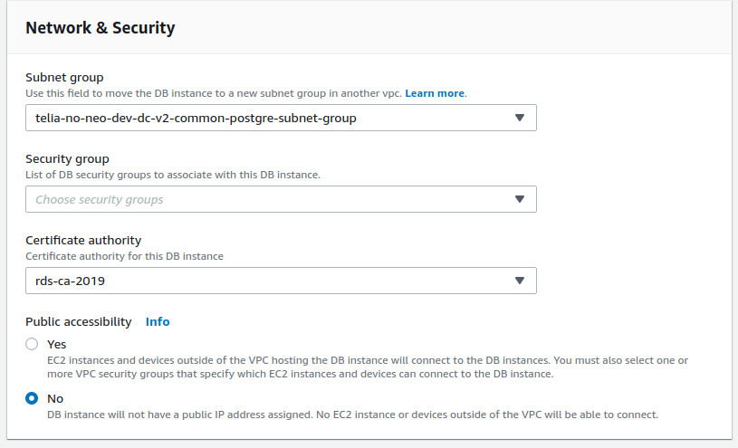
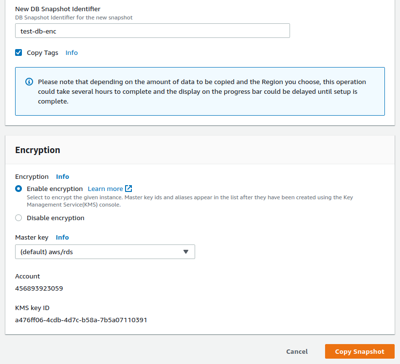

# How to enable encryption on RDS running instance

This howto describes the process to enable RDS storage encryption on running instance using AWS Management Console. 
This process consists of creating a DB snapshot, copying this snapshot into new one with enabled encryption and restoring original DB from encrypted snapshot.  

### Related documentation
[RDS encryption](https://docs.aws.amazon.com/AmazonRDS/latest/UserGuide/Overview.Encryption.html)

[Snapshot copy](https://docs.aws.amazon.com/AmazonRDS/latest/UserGuide/USER_CopySnapshot.html)

[DB restore](https://docs.aws.amazon.com/AmazonRDS/latest/UserGuide/USER_RestoreFromSnapshot.html)

### Check storage encryption status
First check RDS instance storage encryption status on instance Configuration page in Storage section if status is \'Not enabled\'.

 
### Disable instance modifications
The purpose of this step is to ensure that no data will be modified during encryption enablement. 
This can be done multiple ways depending on your AWS security policies. 
For example disabling network access by removing instance security group as shown on images below.

### Take instance snapshot
In first step you have to create unencrypted DB instance snapshot. This can take a while. You have to wait until snapshot creation finishes.

### Copy snapshot
Then copy this unencrypted snapshot into new snapshot.

In copy dialog enable encryption for new snapshot and choose encryption key.

### Restore new snapshot
After snapshot creation you have encrypted DB instance data. 
Next step is to restore this snapshot into new DB instance. 
This instance will have storage encryption enabled. 
In restore dialog you have to specify new instance parameters - fill the same parameters as original instance has. Don't forget to add original security group.

### Rename DB instances
Now you have DB instance with encrypted data. You can check DB consistency and its content. You can also reconnect applications using DB by changing connection string (instance host).
If you don't want to modify application configuration, you can proceed with further steps to switch name of original instance to new (encrypted) instance.

First modify DB instance identifier of the original instance. Then modify the encrypted instance - change DB instance identifier to the value of original instance. 

### Check DB
You can verify that the applications that use this DB instance are working correctly. 
You can also check the encryption status of the instance storage should be \ 'Enabled \'. 
After performing the checks, you can stop the original instance.

### Final steps
As a last step, check and, if necessary, set up replicas, backups, and monitoring as for the original instance
You can also cleanup old backups and configurations related to original instance and the instance itself.